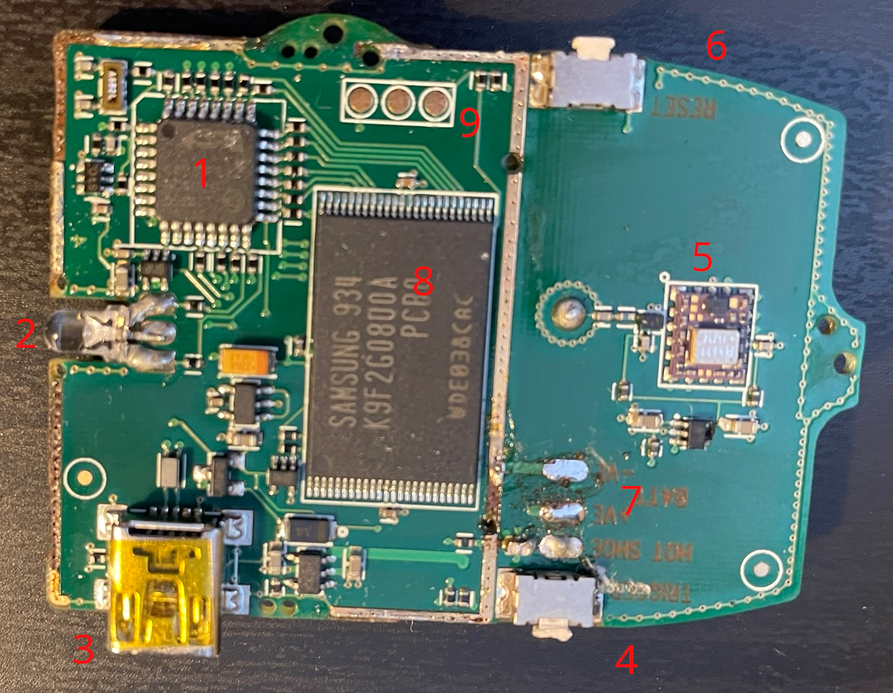

# Capture device hardware

## Overview

The following compontents are visible on the PCB (after RF shield removal):

1. Silicon Labs C8051F342 [Datasheet](https://www.silabs.com/documents/public/data-sheets/C8051F34x.pdf) 
2. Two-color LED (Red/Green)
3. USB Mini-B Port
4. Manual capture toggle switch
5. Supposedly a rakon GRM6510 GPS receiver (no information available)
6. Reset toggle switch 
7. Battery and hot shoe connection points
8. K9F2G08U0A 256Mx8bit Flash
9. Silicon Labs C2 2-wire debug interface (From left to right: C2D, GND, C2CK) [C2 specification](https://www.silabs.com/documents/public/application-notes/AN127.pdf)

